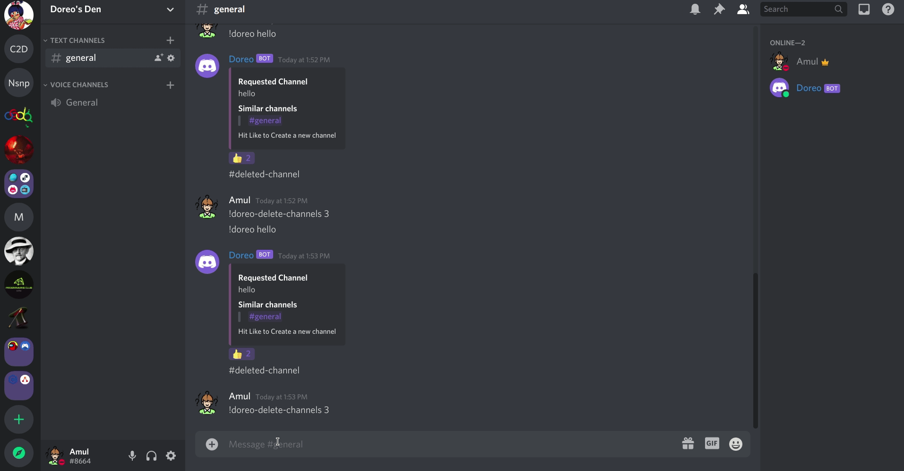
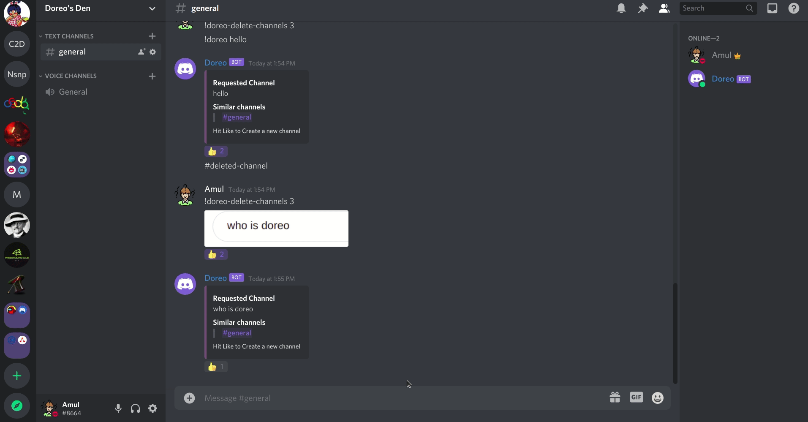
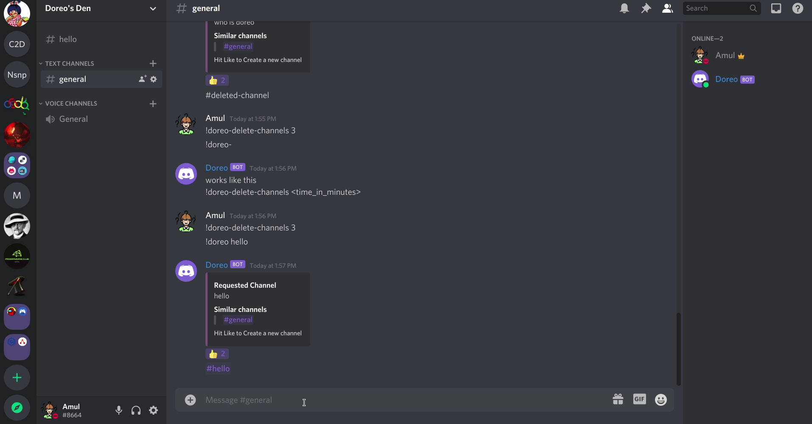

# Doreo
Doreo is an elder brother of [oreo](https://github.com/orientor/oreo/) and obviously is more powerfull also. Doreo is a discord bot that manages channels on your server.

# Features
1. Search for channel and if not found create one. `!doreo <search_query>`
  
2. Give an image with text and doreo will fetch the text and will search for channels based on that text.
  
3. Delete channels created by doreo.
  
